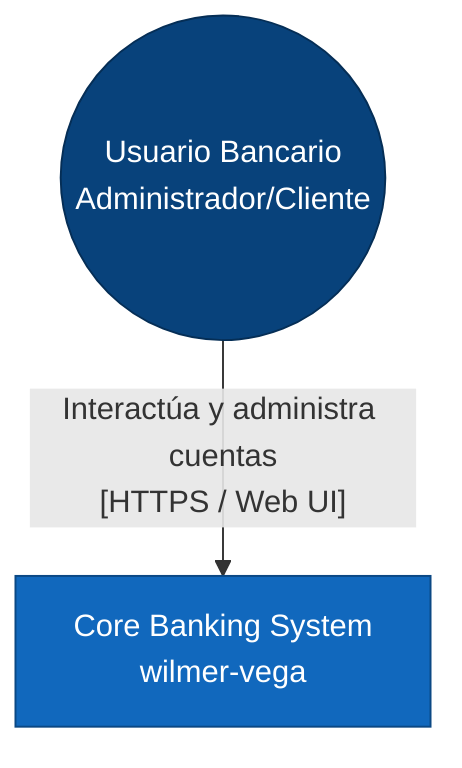
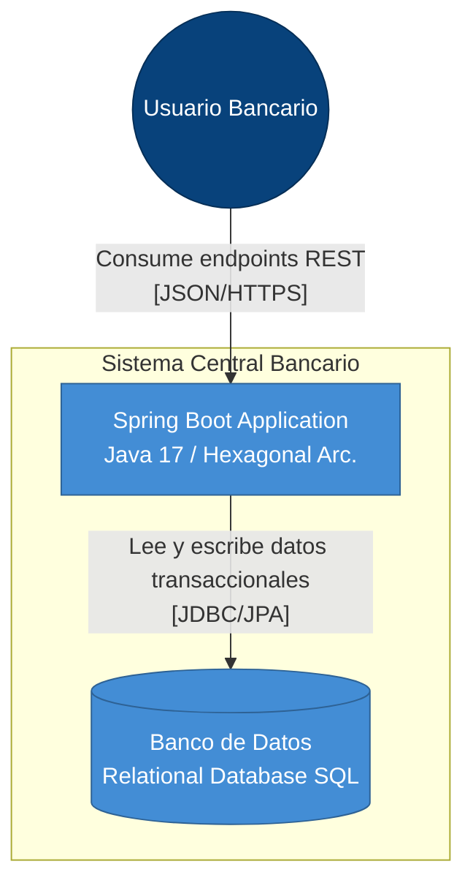
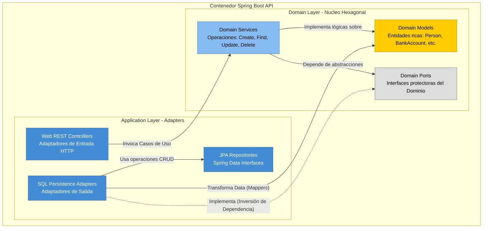

# Arquitectura del Sistema: Core Banking (`wilmer-vega`)

Este documento describe la arquitectura de software del sistema bancario utilizando el estándar **Modelo C4**. 
Los diagramas están generados utilizando Mermaid, lo que permite su renderizado nativo en plataformas como GitHub.

## Nivel 1: Diagrama de Contexto (Context Diagram)

El diagrama de contexto muestra el sistema en su totalidad y cómo interactúa con los usuarios y entidades externas.

**Descripción:**
- **Usuario Bancario:** Representa a los actores del sistema (Administradores, Empleados y Clientes Naturales o Jurídicos) que interactúan con la plataforma.
- **Core Banking System:** El sistema central que gestiona préstamos, transferencias, cuentas de banco, registros de auditoría y la base de clientes.

---

## Nivel 2: Diagrama de Contenedores (Container Diagram)

Al hacer "zoom" en el Core Banking System, observamos los contenedores técnicos que ejecutan la solución.

**Descripción:**
- **Spring Boot Application:** Es el corazón del sistema, expone una API RESTFul, contiene toda la lógica de negocio y obedece al diseño Hexagonal.
- **Banco de Datos (SQL):** Repositorio de la información persistente, almacena el historial inmutable de transferencias (AuditLog) y el estado financiero actual.

---

## Nivel 3: Diagrama de Componentes (Component Diagram)

Acercándonos hacia dentro del contenedor del Backend o API, visualizamos cómo la estructura se alinea a los principios de la **Arquitectura Hexagonal (Ports and Adapters)**.

**Descripción de la Inversión de Dependencias (DIP):**
Como exige la Arquitectura Hexagonal, el Dominio (servicios, puertos y modelos) **no tiene dependencias externas**. Es la Capa de Infraestructura (`PersistenceAdapters`) la que implementa los `DomainPorts`, garantizando que la lógica del banco pueda existir y probarse con independencia de la base de datos subyacente.
