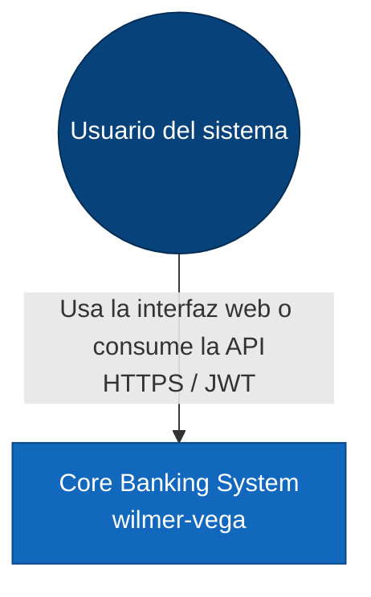
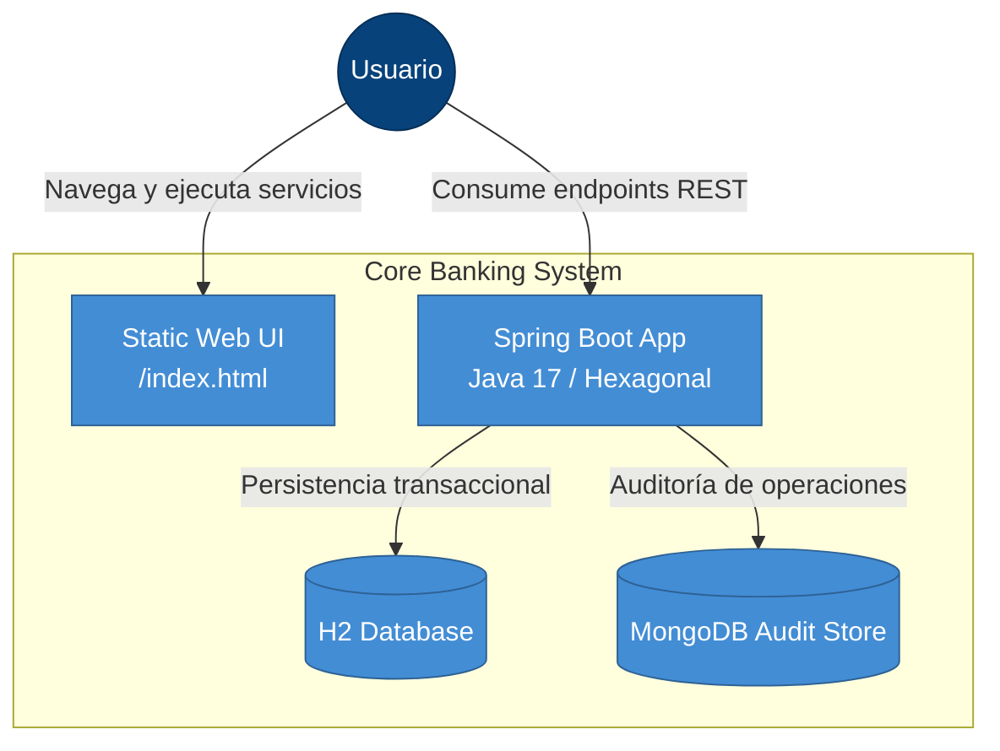
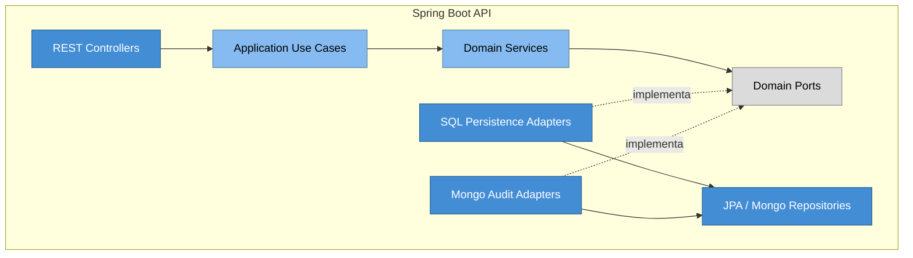

# Arquitectura del Sistema: Core Banking (`wilmer-vega`)

Este documento resume la arquitectura con el modelo C4. Los diagramas están escritos en Mermaid para renderizarse en GitHub y en el editor.

## Nivel 1: Contexto

El sistema es utilizado por administradores, analistas, supervisores, empleados y clientes. Todos interactúan mediante la UI visual o mediante la API REST protegida.

## Nivel 2: Contenedores

La interfaz estática vive junto a la aplicación y sirve como panel de demostración. H2 conserva el estado del negocio y MongoDB guarda la bitácora.

## Nivel 3: Componentes

El dominio no depende de Spring ni de la base de datos. Los adaptadores implementan los puertos y mantienen la inversión de dependencias.

## Resumen técnico

- Frontend estático para demostración rápida.
- API REST con JWT y seguridad por roles.
- Persistencia operativa en H2.
- Bitácora técnica en MongoDB.
- Estructura hexagonal con separación clara entre dominio, aplicación e infraestructura.
