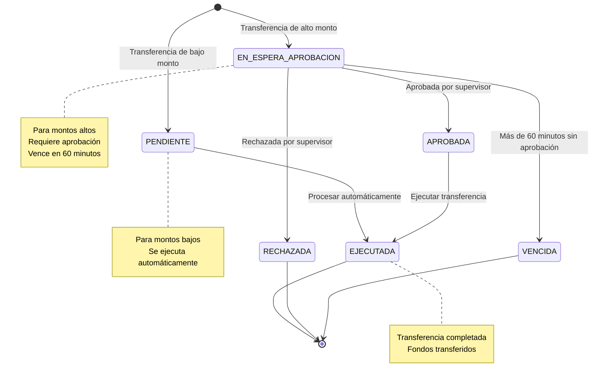
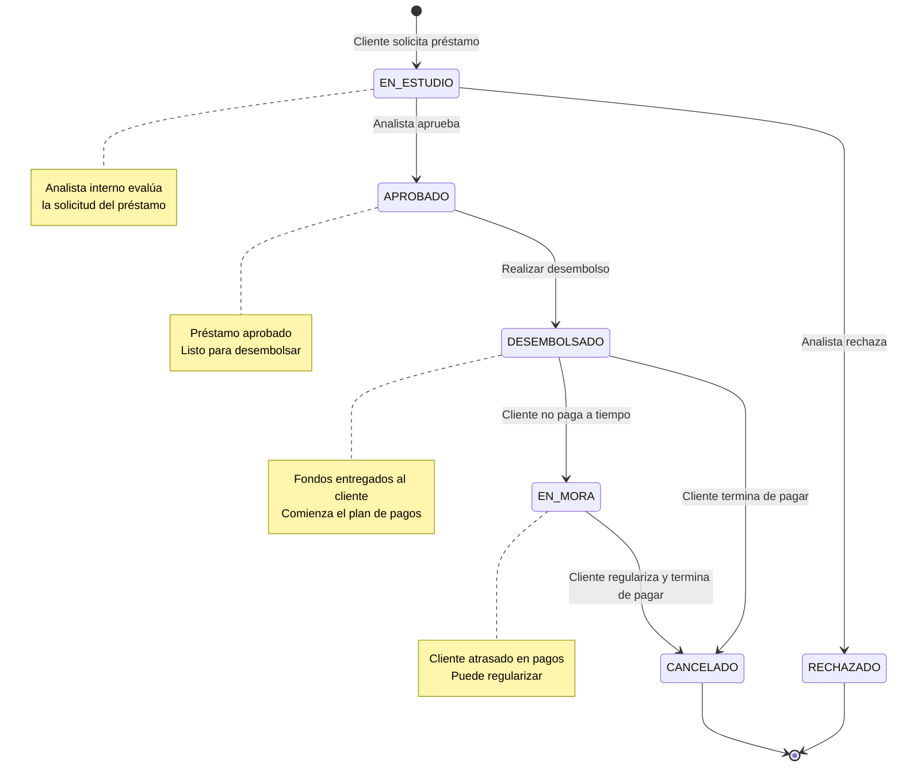
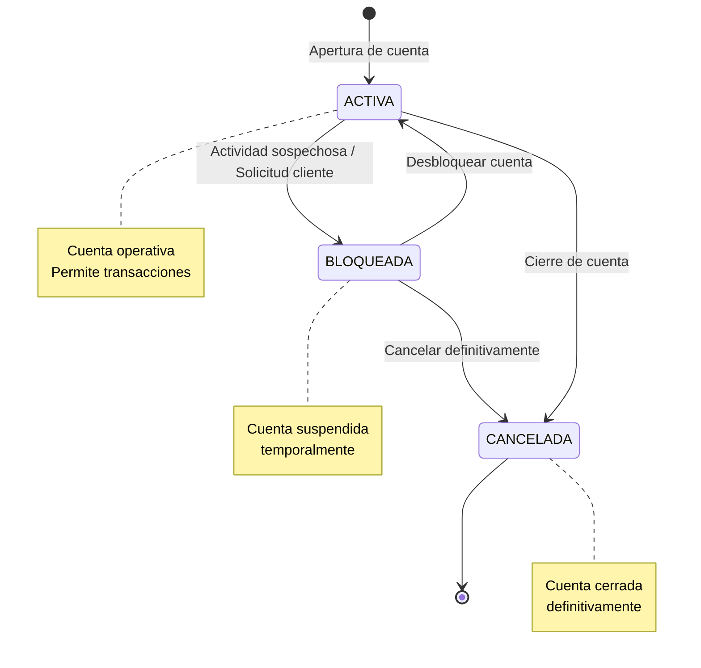
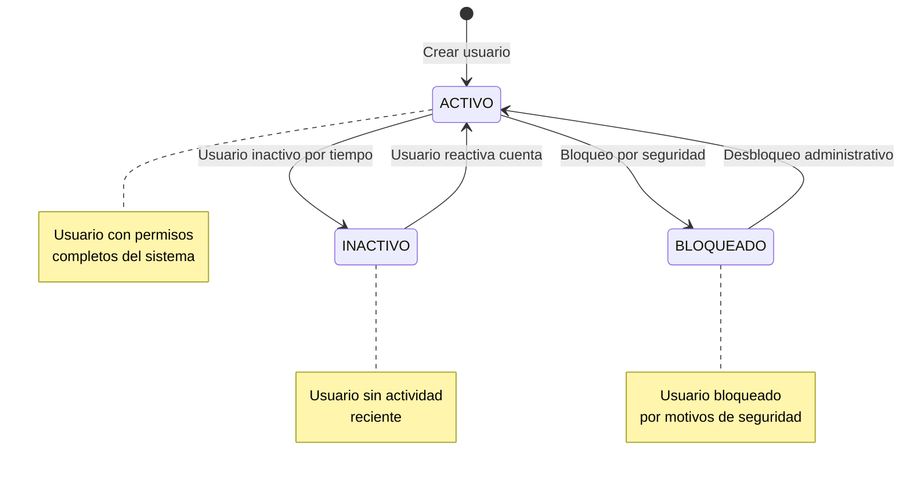
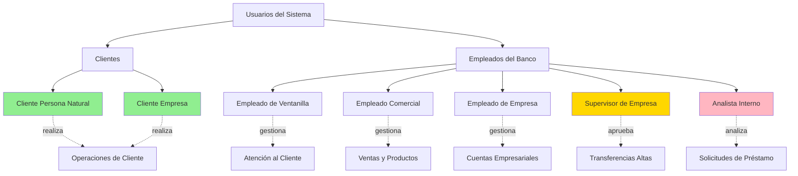
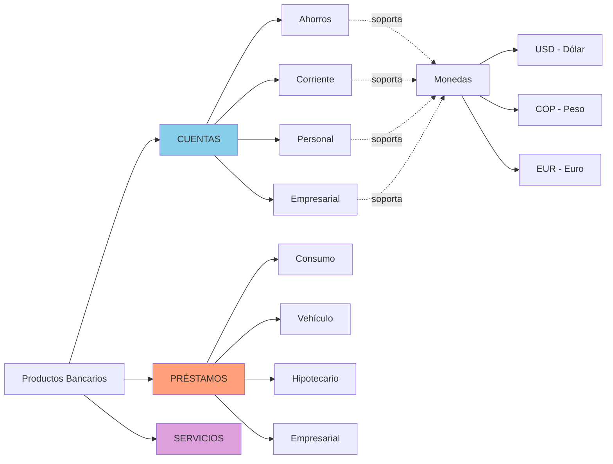
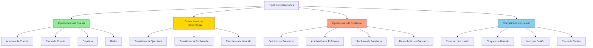

# 📊 DIAGRAMAS DEL SISTEMA BANCARIO - GESTIÓN DE UN BANCO

> **Proyecto:** Gestión de un Banco - Wilmer Vega  
> **Fecha:** 12 de marzo de 2026  
> **Paquete:** gestiondeunbanco.wilmervega.domain.models

---

## 📋 ÍNDICE

1. [Diagrama de Clases del Modelo](#1-diagrama-de-clases-del-modelo)
2. [Diagrama de Estados - Transferencias](#2-diagrama-de-estados---transferencias)
3. [Diagrama de Estados - Préstamos](#3-diagrama-de-estados---préstamos)
4. [Diagrama de Estados - Cuentas Bancarias](#4-diagrama-de-estados---cuentas-bancarias)
5. [Diagrama de Estados - Usuarios](#5-diagrama-de-estados---usuarios)
6. [Diagrama de Roles del Sistema](#6-diagrama-de-roles-del-sistema)
7. [Diagrama de Tipos de Productos Bancarios](#7-diagrama-de-tipos-de-productos-bancarios)
8. [Diagrama de Flujo - Tipos de Operaciones](#8-diagrama-de-flujo---tipos-de-operaciones)
9. [Resumen del Modelo](#9-resumen-del-modelo)

---

## 1. DIAGRAMA DE CLASES DEL MODELO

Este diagrama muestra todas las clases y enumeraciones actuales del dominio del sistema bancario, con la jerarquía de usuarios refactorizada.

```mermaid
classDiagram
    %% ─── Jerarquía de Personas ─────────────────────────────────
    class Person {
        +Long id
        +String email
        +String phone
        +String address
    }

    class Client {
        <<abstract>>
        +String documentNumber
        +List~BankAccount~ bankAccounts
        +List~Loan~ loans
    }

    class NaturalClient {
        +String fullName
        +LocalDate birthDate
        +SystemRole role
        +List~SystemUser~ systemUsers
        +List~CompanyClient~ representedCompanies
    }

    class CompanyClient {
        +String businessName
        +NaturalClient legalRepresentative
    }

    %% ─── Jerarquía de Usuarios ────────────────────────────────
    class UserManager {
        +String fullName
        +Date birthDate
        +UserStatus userStatus
    }

    class SystemUser {
        +String relatedId
        +NaturalClient naturalClient
        +CompanyClient companyClient
        +String identificationId
        +SystemRole role
        +List~Transfer~ createdTransfers
        +List~Transfer~ approvedTransfers
        +List~AuditLog~ auditLogs
    }

    class User {
        +Long userId
        +Client relatedClient
        +String documentNumber
        +SystemRole systemRole
        +String username
        +String password
    }

    %% ─── Entidades del Negocio ────────────────────────────────
    class BankAccount {
        +Long id
        +String accountNumber
        +AccountType accountType
        +BigDecimal currentBalance
        +Currency currency
        +AccountStatus accountStatus
        +LocalDate openingDate
        +List~Transfer~ outgoingTransfers
        +List~Transfer~ incomingTransfers
        +validateState()
        +hasSingleHolder() boolean
    }

    class BankingProduct {
        +Long id
        +String productCode
        +String productName
        +ProductCategory category
        +Boolean requiresApproval
    }

    class Loan {
        +Long loanId
        +LoanType loanType
        +BigDecimal requestedAmount
        +BigDecimal approvedAmount
        +BigDecimal interestRate
        +Integer termInMonths
        +LoanStatus loanStatus
        +Date approvalDate
        +Date disbursementDate
    }

    class Transfer {
        +Long transferId
        +BigDecimal amount
        +Date creationDateTime
        +Date approvalDateTime
        +TransferStatus transferStatus
    }

    class AuditLog {
        +Long auditLogId
        +OperationType operationType
        +LocalDateTime operationDateTime
        +Long userId
        +String userRole
        +String affectedProductId
        +Map~String, Object~ details
    }

    %% ─── Enumeraciones ────────────────────────────────────────
    class SystemRole {
        <<enumeration>>
        NATURAL_CLIENT
        COMPANY_CLIENT
        TELLER_EMPLOYEE
        COMMERCIAL_EMPLOYEE
        COMPANY_EMPLOYEE
        COMPANY_SUPERVISOR
        INTERNAL_ANALYST
        +String getDescription()
    }

    class UserStatus {
        <<enumeration>>
        ACTIVE
        INACTIVE
        BLOCKED
        +String getDescription()
    }

    class AccountStatus {
        <<enumeration>>
        ACTIVE
        BLOCKED
        CANCELLED
        +String getDescription()
    }

    class AccountType {
        <<enumeration>>
        SAVINGS
        CHECKING
        PERSONAL
        BUSINESS
        +String getDescription()
    }

    class Currency {
        <<enumeration>>
        USD
        COP
        EUR
        +String getDescription()
    }

    class LoanStatus {
        <<enumeration>>
        UNDER_REVIEW
        APPROVED
        REJECTED
        DISBURSED
        OVERDUE
        CANCELLED
        +String getDescription()
    }

    class LoanType {
        <<enumeration>>
        CONSUMER
        VEHICLE
        MORTGAGE
        BUSINESS
        +String getDescription()
    }

    class TransferStatus {
        <<enumeration>>
        PENDING
        AWAITING_APPROVAL
        APPROVED
        EXECUTED
        REJECTED
        EXPIRED
        +String getDescription()
    }

    class ProductCategory {
        <<enumeration>>
        ACCOUNTS
        LOANS
        SERVICES
        +String getDescription()
    }

    class OperationType {
        <<enumeration>>
        ACCOUNT_OPENING
        ACCOUNT_CLOSURE
        DEPOSIT
        WITHDRAWAL
        TRANSFER_EXECUTED
        TRANSFER_REJECTED
        TRANSFER_EXPIRED
        LOAN_REQUEST
        LOAN_APPROVAL
        LOAN_REJECTION
        LOAN_DISBURSEMENT
        USER_CREATION
        USER_BLOCKING
        LOGIN
        LOGOUT
        +String getDescription()
    }

    %% ─── Herencia ─────────────────────────────────────────────
    Person          <|-- Client
    Person          <|-- UserManager
    Client          <|-- NaturalClient
    Client          <|-- CompanyClient
    UserManager     <|-- SystemUser
    UserManager     <|-- User

    %% ─── Asociaciones ─────────────────────────────────────────
    Client          "1" --> "0..*" BankAccount       : bankAccounts
    Client          "1" --> "0..*" Loan              : loans
    NaturalClient   "1" --> "0..*" SystemUser        : systemUsers
    NaturalClient   "1" --> "0..*" CompanyClient     : representedCompanies

    SystemUser      "1" --> "0..*" Transfer          : createdTransfers
    SystemUser      "1" --> "0..*" Transfer          : approvedTransfers
    SystemUser      "1" --> "0..*" AuditLog          : auditLogs
    SystemUser      --> NaturalClient                : naturalClient
    SystemUser      --> CompanyClient                : companyClient

    User            --> Client                       : relatedClient

    BankAccount     --> BankingProduct               : bankingProduct
    BankAccount     --> Client                       : holder
    BankAccount     --> AccountType
    BankAccount     --> AccountStatus
    BankAccount     --> Currency

    Loan            --> BankingProduct               : bankingProduct
    Loan            --> Client                       : applicant
    Loan            --> BankAccount                  : disbursementAccount
    Loan            --> LoanType
    Loan            --> LoanStatus

    Transfer        --> BankAccount                  : sourceAccount
    Transfer        --> BankAccount                  : destinationAccount
    Transfer        --> SystemUser                   : creatorUser
    Transfer        --> SystemUser                   : approverUser
    Transfer        --> TransferStatus

    AuditLog        --> SystemUser                   : user
    AuditLog        --> OperationType

    NaturalClient   --> SystemRole
    SystemUser      --> SystemRole
    User            --> SystemRole
    UserManager     --> UserStatus
    BankingProduct  --> ProductCategory
```



**Descripción de la jerarquía actualizada:**
- **Person**: clase base con datos de contacto comunes
- **UserManager**: nueva clase madre de usuarios — concentra `fullName`, `birthDate` y `userStatus`
- **SystemUser** `extends UserManager`: usuario del sistema bancario con rol, transferencias y logs
- **User** `extends UserManager`: usuario de acceso con credenciales (`username`, `password`)
- **Client** `extends Person`: clase base para clientes del banco
- **NaturalClient** `extends Client`: cliente persona natural con empresas representadas
- **CompanyClient** `extends Client`: cliente empresa con representante legal

---

## 2. DIAGRAMA DE ESTADOS - TRANSFERENCIAS

Flujo de estados para las transferencias bancarias según el monto.



**Flujos permitidos:**
- **Flujo bajo monto:** `PENDIENTE → EJECUTADA`
- **Flujo alto monto:** `EN_ESPERA_APROBACION → APROBADA → EJECUTADA`
- **Flujo de rechazo:** `EN_ESPERA_APROBACION → RECHAZADA`
- **Flujo de vencimiento:** `EN_ESPERA_APROBACION → VENCIDA` (60 minutos)

---

## 3. DIAGRAMA DE ESTADOS - PRÉSTAMOS

Ciclo de vida completo de un préstamo bancario.



**Flujos permitidos:**
- **Flujo de evaluación:** `EN_ESTUDIO → APROBADO | RECHAZADO`
- **Flujo de desembolso:** `APROBADO → DESEMBOLSADO`
- **Flujo de pago:** `DESEMBOLSADO → CANCELADO`
- **Flujo de mora:** `DESEMBOLSADO → EN_MORA → CANCELADO`

---

## 4. DIAGRAMA DE ESTADOS - CUENTAS BANCARIAS

Estados posibles de una cuenta bancaria.



**Estados:**
- **ACTIVA**: Cuenta operativa que permite todas las transacciones
- **BLOQUEADA**: Cuenta temporalmente suspendida (reversible)
- **CANCELADA**: Cuenta cerrada permanentemente

---

## 5. DIAGRAMA DE ESTADOS - USUARIOS

Gestión del ciclo de vida de usuarios del sistema.



**Estados:**
- **ACTIVO**: Usuario con acceso completo al sistema
- **INACTIVO**: Usuario sin actividad reciente (reversible)
- **BLOQUEADO**: Usuario bloqueado por seguridad (requiere desbloqueo administrativo)

---

## 6. DIAGRAMA DE ROLES DEL SISTEMA

Jerarquía y clasificación de roles en el sistema bancario.



**7 Roles del Sistema:**

### Clientes:
1. **CLIENTE_PERSONA_NATURAL** - Personas físicas
2. **CLIENTE_EMPRESA** - Personas jurídicas

### Empleados:
3. **EMPLEADO_VENTANILLA** - Atención al cliente
4. **EMPLEADO_COMERCIAL** - Ventas y productos
5. **EMPLEADO_EMPRESA** - Gestión de cuentas empresariales
6. **SUPERVISOR_EMPRESA** - Aprobación de transferencias de alto monto
7. **ANALISTA_INTERNO** - Evaluación de solicitudes de préstamo

---

## 7. DIAGRAMA DE TIPOS DE PRODUCTOS BANCARIOS

Catálogo de productos y servicios del banco.



**Categorías de Productos:**

### CUENTAS (4 tipos):
- **Ahorros** - Cuenta de ahorro personal
- **Corriente** - Cuenta corriente con cheques
- **Personal** - Cuenta personal estándar
- **Empresarial** - Cuenta para empresas

### PRÉSTAMOS (4 tipos):
- **Consumo** - Préstamo personal
- **Vehículo** - Financiamiento de vehículos
- **Hipotecario** - Préstamo para vivienda
- **Empresarial** - Préstamo comercial

### SERVICIOS:
- Otros servicios bancarios

**Monedas Soportadas:**
- **USD** - Dólar Estadounidense
- **COP** - Peso Colombiano
- **EUR** - Euro

---

## 8. DIAGRAMA DE FLUJO - TIPOS DE OPERACIONES

Clasificación de las 15 operaciones del sistema.



**15 Tipos de Operaciones:**

### Operaciones de Cuenta (4):
1. APERTURA_CUENTA
2. CIERRE_CUENTA
3. DEPOSITO
4. RETIRO

### Operaciones de Transferencia (3):
5. TRANSFERENCIA_EJECUTADA
6. TRANSFERENCIA_RECHAZADA
7. TRANSFERENCIA_VENCIDA

### Operaciones de Préstamo (4):
8. SOLICITUD_PRESTAMO
9. APROBACION_PRESTAMO
10. RECHAZO_PRESTAMO
11. DESEMBOLSO_PRESTAMO

### Operaciones de Usuario (4):
12. CREACION_USUARIO
13. BLOQUEO_USUARIO
14. INICIO_SESION
15. CIERRE_SESION

---

## 9. RESUMEN DEL MODELO

### 📦 Estructura del Paquete `models/`

```
gestiondeunbanco.wilmervega.domain.models/
├── Person.java                  (clase base)
├── UserManager.java             (clase madre de usuarios)
├── SystemUser.java              (extiende UserManager)
├── User.java                    (extiende UserManager)
├── NaturalClient.java           (extiende Person)
├── CompanyClient.java           (extiende NaturalClient)
├── BankAccount.java
├── BankingProduct.java
├── Loan.java
├── Transfer.java
├── AuditLog.java
└── Enumeraciones (10):
    ├── AccountStatus.java
    ├── AccountType.java
    ├── Currency.java
    ├── LoanStatus.java
    ├── LoanType.java
    ├── OperationType.java
    ├── ProductCategory.java
    ├── SystemRole.java
    ├── TransferStatus.java
    └── UserStatus.java
```

### 🎯 Jerarquía de Clases

```
Person
├── NaturalClient
│   └── CompanyClient
└── UserManager                  ← clase madre de gestión de usuarios
    ├── SystemUser               ← usuario del sistema bancario
    └── User                     ← usuario de acceso con credenciales
```

### 📊 Enumeraciones del Dominio

| Enumeración | Valores | Descripción |
|-------------|---------|-------------|
| **SystemRole** | 7 | Roles de usuarios y empleados |
| **UserStatus** | 3 | ACTIVE · INACTIVE · BLOCKED |
| **AccountStatus** | 3 | ACTIVE · BLOCKED · CANCELLED |
| **AccountType** | 4 | SAVINGS · CHECKING · PERSONAL · BUSINESS |
| **Currency** | 3 | USD · COP · EUR |
| **LoanStatus** | 6 | UNDER_REVIEW → APPROVED/REJECTED → DISBURSED → OVERDUE/CANCELLED |
| **LoanType** | 4 | CONSUMER · VEHICLE · MORTGAGE · BUSINESS |
| **TransferStatus** | 6 | PENDING · AWAITING_APPROVAL · APPROVED · EXECUTED · REJECTED · EXPIRED |
| **ProductCategory** | 3 | ACCOUNTS · LOANS · SERVICES |
| **OperationType** | 15 | Todas las operaciones auditables |

### 🔄 Reglas de Negocio Principales

#### Transferencias
- **Bajo monto:** `PENDING → EXECUTED` (automático)
- **Alto monto:** `AWAITING_APPROVAL → APPROVED → EXECUTED`
- **Rechazo:** `AWAITING_APPROVAL → REJECTED`
- **Vencimiento:** `AWAITING_APPROVAL → EXPIRED` (60 minutos sin aprobación)

#### Préstamos
- **Evaluación:** `UNDER_REVIEW → APPROVED | REJECTED`
- **Desembolso:** `APPROVED → DISBURSED`
- **Pago:** `DISBURSED → CANCELLED`
- **Mora:** `DISBURSED → OVERDUE → CANCELLED`

#### Cuentas Bancarias
- Debe tener **exactamente un titular** (natural o empresa, nunca ambos)
- `validateState()` impide saldo negativo y titular múltiple

#### Usuarios
- `UserManager` centraliza `fullName`, `birthDate` y `userStatus`
- `SystemUser` agrega rol bancario y registro de operaciones
- `User` agrega credenciales de acceso (`username`, `password`)

---

## 📝 Notas de Implementación

### Tecnologías Utilizadas
- **Spring Boot 3** · **Java 17**
- **Lombok:** `@Getter`, `@Setter`, `@NoArgsConstructor`
- **Spring Security:** configuración de seguridad base
- **Maven Wrapper:** gestión del ciclo de build

### Patrones Aplicados
- **Arquitectura Hexagonal:** Estricta separación multicapa (Web, Aplicación, Dominio puro e Infraestructura).
- **Herencia limpia:** jerarquía `Person → UserManager → SystemUser/User`
- **Value Objects:** enumeraciones para tipos y estados
- **Validación de negocio:** en métodos de entidad (`BankAccount.validateState()`)

---

**Documento actualizado automáticamente — 12 de marzo de 2026**  
**Sistema de Gestión Bancaria — Wilmer Vega**
Wilmer Vega - Construcción de Software 2
