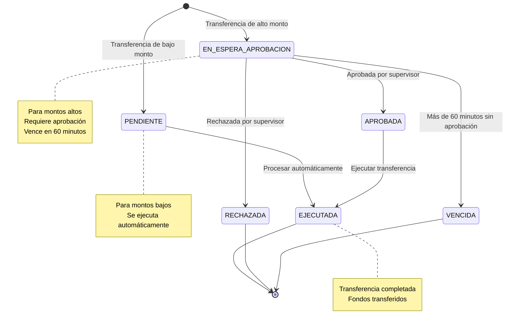
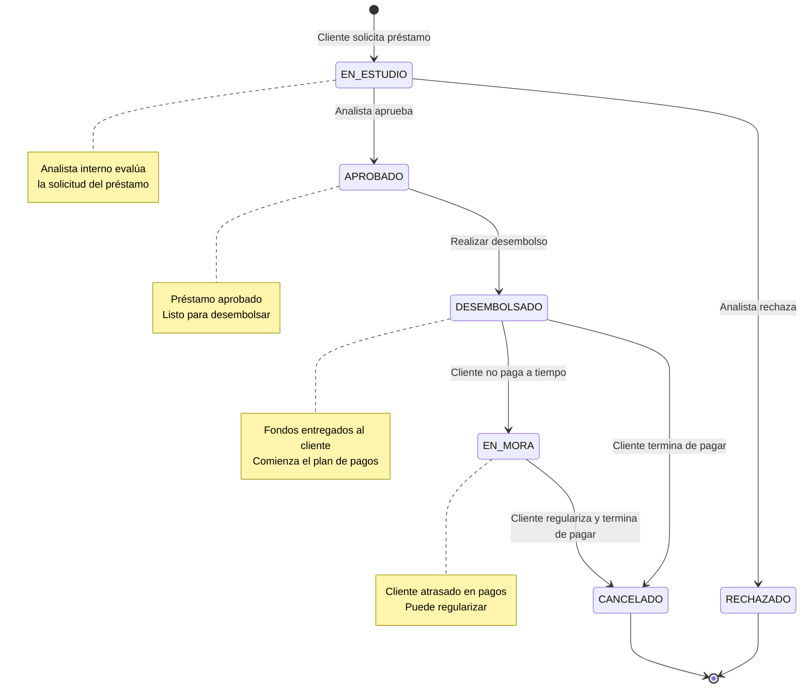
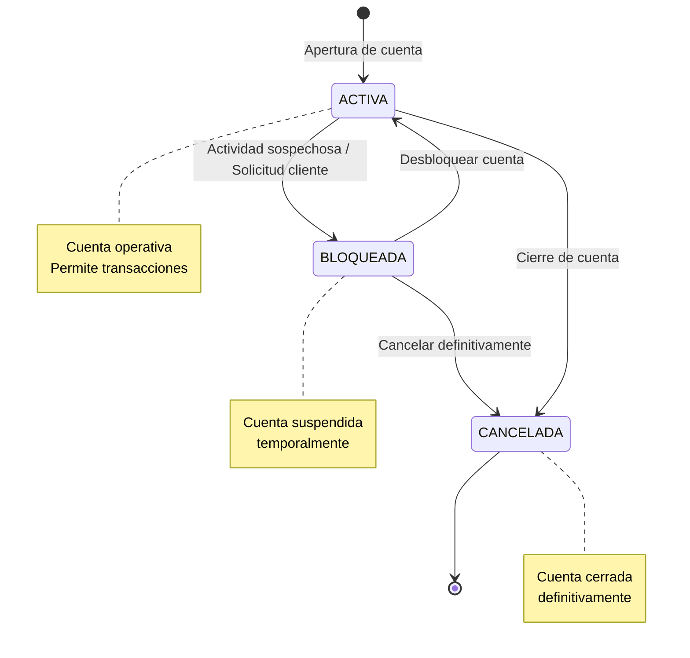
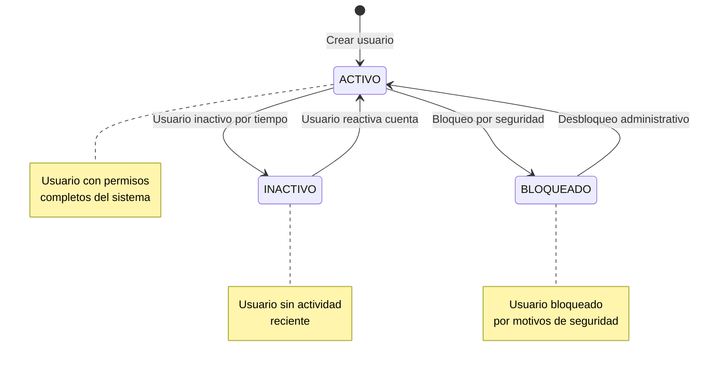
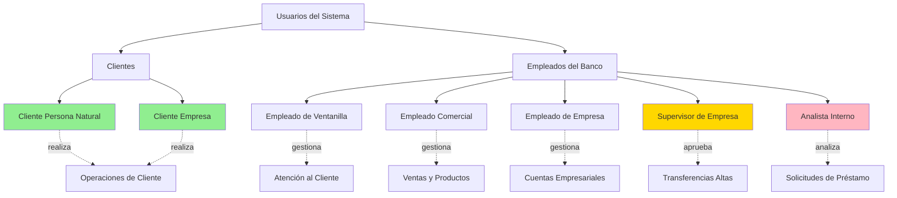
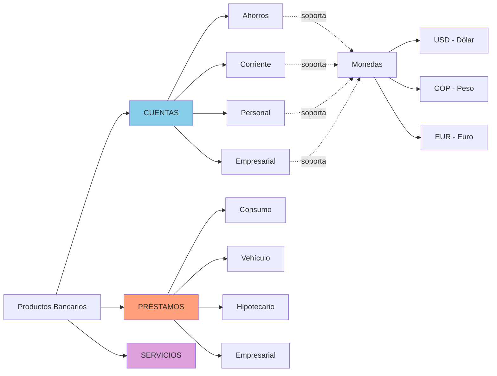
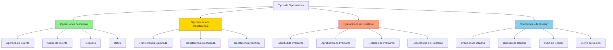

# 📊 DIAGRAMAS DEL SISTEMA BANCARIO - GESTIÓN DE UN BANCO

> **Proyecto:** Gestión de un Banco - Wilmer Vega  
> **Fecha:** 2 de marzo de 2026  
> **Paquete:** gestiondeunbanco.wilmervega.domain.models

---

## 📋 ÍNDICE

1. [Diagrama de Clases del Modelo](#1-diagrama-de-clases-del-modelo)
2. [Diagrama de Estados - Transferencias](#2-diagrama-de-estados---transferencias)
3. [Diagrama de Estados - Préstamos](#3-diagrama-de-estados---préstamos)
4. [Diagrama de Estados - Cuentas Bancarias](#4-diagrama-de-estados---cuentas-bancarias)
5. [Diagrama de Estados - Usuarios](#5-diagrama-de-estados---usuarios)
6. [Diagrama de Roles del Sistema](#6-diagrama-de-roles-del-sistema)
7. [Diagrama de Tipos de Productos Bancarios](#7-diagrama-de-tipos-de-productos-bancarios)
8. [Diagrama de Flujo - Tipos de Operaciones](#8-diagrama-de-flujo---tipos-de-operaciones)
9. [Resumen del Modelo](#9-resumen-del-modelo)

---

## 1. DIAGRAMA DE CLASES DEL MODELO

Este diagrama muestra todas las clases y enumeraciones del dominio del sistema bancario.

```mermaid
classDiagram
    class ClientePersonaNatural {
        +Long id
        +String nombreCompleto
        +String numeroDocumento
        +String correoElectronico
        +String telefono
        +String direccion
        +LocalDate fechaNacimiento
        +RolSistema rol
        +String contrasenaHash
        +calcularEdad() int
        +esMayorDeEdad() boolean
        +setFechaNacimiento(LocalDate)
    }

    class NaturalClient {
        +Long id
        +String fullName
        +String documentNumber
        +String email
        +String phoneNumber
    }

    class RolSistema {
        <<enumeration>>
        CLIENTE_PERSONA_NATURAL
        CLIENTE_EMPRESA
        EMPLEADO_VENTANILLA
        EMPLEADO_COMERCIAL
        EMPLEADO_EMPRESA
        SUPERVISOR_EMPRESA
        ANALISTA_INTERNO
        +String getDescripcion()
    }

    class EstadoUsuario {
        <<enumeration>>
        ACTIVO
        INACTIVO
        BLOQUEADO
        +String getDescripcion()
    }

    class EstadoCuenta {
        <<enumeration>>
        ACTIVA
        BLOQUEADA
        CANCELADA
        +String getDescripcion()
    }

    class TipoCuenta {
        <<enumeration>>
        AHORROS
        CORRIENTE
        PERSONAL
        EMPRESARIAL
        +String getDescripcion()
    }

    class Moneda {
        <<enumeration>>
        USD
        COP
        EUR
        +String getDescripcion()
    }

    class EstadoPrestamo {
        <<enumeration>>
        EN_ESTUDIO
        APROBADO
        RECHAZADO
        DESEMBOLSADO
        EN_MORA
        CANCELADO
        +String getDescripcion()
    }

    class TipoPrestamo {
        <<enumeration>>
        CONSUMO
        VEHICULO
        HIPOTECARIO
        EMPRESARIAL
        +String getDescripcion()
    }

    class EstadoTransferencia {
        <<enumeration>>
        PENDIENTE
        EN_ESPERA_APROBACION
        APROBADA
        EJECUTADA
        RECHAZADA
        VENCIDA
        +String getDescripcion()
    }

    class CategoriaProducto {
        <<enumeration>>
        CUENTAS
        PRESTAMOS
        SERVICIOS
        +String getDescripcion()
    }

    class TipoOperacion {
        <<enumeration>>
        APERTURA_CUENTA
        CIERRE_CUENTA
        DEPOSITO
        RETIRO
        TRANSFERENCIA_EJECUTADA
        TRANSFERENCIA_RECHAZADA
        TRANSFERENCIA_VENCIDA
        SOLICITUD_PRESTAMO
        APROBACION_PRESTAMO
        RECHAZO_PRESTAMO
        DESEMBOLSO_PRESTAMO
        CREACION_USUARIO
        BLOQUEO_USUARIO
        INICIO_SESION
        CIERRE_SESION
        +String getDescripcion()
    }

    ClientePersonaNatural --> RolSistema : tiene
    ClientePersonaNatural ..> EstadoUsuario : puede tener
```



**Descripción:**
- **ClientePersonaNatural**: Entidad principal que representa a un cliente persona física
- **NaturalClient**: Versión simplificada del cliente natural
- **10 Enumeraciones** que definen los diferentes tipos y estados del sistema

---

## 2. DIAGRAMA DE ESTADOS - TRANSFERENCIAS

Flujo de estados para las transferencias bancarias según el monto.



**Flujos permitidos:**
- **Flujo bajo monto:** `PENDIENTE → EJECUTADA`
- **Flujo alto monto:** `EN_ESPERA_APROBACION → APROBADA → EJECUTADA`
- **Flujo de rechazo:** `EN_ESPERA_APROBACION → RECHAZADA`
- **Flujo de vencimiento:** `EN_ESPERA_APROBACION → VENCIDA` (60 minutos)

---

## 3. DIAGRAMA DE ESTADOS - PRÉSTAMOS

Ciclo de vida completo de un préstamo bancario.



**Flujos permitidos:**
- **Flujo de evaluación:** `EN_ESTUDIO → APROBADO | RECHAZADO`
- **Flujo de desembolso:** `APROBADO → DESEMBOLSADO`
- **Flujo de pago:** `DESEMBOLSADO → CANCELADO`
- **Flujo de mora:** `DESEMBOLSADO → EN_MORA → CANCELADO`

---

## 4. DIAGRAMA DE ESTADOS - CUENTAS BANCARIAS

Estados posibles de una cuenta bancaria.



**Estados:**
- **ACTIVA**: Cuenta operativa que permite todas las transacciones
- **BLOQUEADA**: Cuenta temporalmente suspendida (reversible)
- **CANCELADA**: Cuenta cerrada permanentemente

---

## 5. DIAGRAMA DE ESTADOS - USUARIOS

Gestión del ciclo de vida de usuarios del sistema.



**Estados:**
- **ACTIVO**: Usuario con acceso completo al sistema
- **INACTIVO**: Usuario sin actividad reciente (reversible)
- **BLOQUEADO**: Usuario bloqueado por seguridad (requiere desbloqueo administrativo)

---

## 6. DIAGRAMA DE ROLES DEL SISTEMA

Jerarquía y clasificación de roles en el sistema bancario.



**7 Roles del Sistema:**

### Clientes:
1. **CLIENTE_PERSONA_NATURAL** - Personas físicas
2. **CLIENTE_EMPRESA** - Personas jurídicas

### Empleados:
3. **EMPLEADO_VENTANILLA** - Atención al cliente
4. **EMPLEADO_COMERCIAL** - Ventas y productos
5. **EMPLEADO_EMPRESA** - Gestión de cuentas empresariales
6. **SUPERVISOR_EMPRESA** - Aprobación de transferencias de alto monto
7. **ANALISTA_INTERNO** - Evaluación de solicitudes de préstamo

---

## 7. DIAGRAMA DE TIPOS DE PRODUCTOS BANCARIOS

Catálogo de productos y servicios del banco.



**Categorías de Productos:**

### CUENTAS (4 tipos):
- **Ahorros** - Cuenta de ahorro personal
- **Corriente** - Cuenta corriente con cheques
- **Personal** - Cuenta personal estándar
- **Empresarial** - Cuenta para empresas

### PRÉSTAMOS (4 tipos):
- **Consumo** - Préstamo personal
- **Vehículo** - Financiamiento de vehículos
- **Hipotecario** - Préstamo para vivienda
- **Empresarial** - Préstamo comercial

### SERVICIOS:
- Otros servicios bancarios

**Monedas Soportadas:**
- **USD** - Dólar Estadounidense
- **COP** - Peso Colombiano
- **EUR** - Euro

---

## 8. DIAGRAMA DE FLUJO - TIPOS DE OPERACIONES

Clasificación de las 15 operaciones del sistema.



**15 Tipos de Operaciones:**

### Operaciones de Cuenta (4):
1. APERTURA_CUENTA
2. CIERRE_CUENTA
3. DEPOSITO
4. RETIRO

### Operaciones de Transferencia (3):
5. TRANSFERENCIA_EJECUTADA
6. TRANSFERENCIA_RECHAZADA
7. TRANSFERENCIA_VENCIDA

### Operaciones de Préstamo (4):
8. SOLICITUD_PRESTAMO
9. APROBACION_PRESTAMO
10. RECHAZO_PRESTAMO
11. DESEMBOLSO_PRESTAMO

### Operaciones de Usuario (4):
12. CREACION_USUARIO
13. BLOQUEO_USUARIO
14. INICIO_SESION
15. CIERRE_SESION

---

## 9. RESUMEN DEL MODELO

### 📦 Estructura del Paquete `models/`

```
gestiondeunbanco.wilmervega.domain.models/
├── ClientePersonaNatural.java (Entidad JPA)
├── NaturalClient.java (Entidad JPA)
└── Enumeraciones (10):
    ├── CategoriaProducto.java
    ├── EstadoCuenta.java
    ├── EstadoPrestamo.java
    ├── EstadoTransferencia.java
    ├── EstadoUsuario.java
    ├── Moneda.java
    ├── RolSistema.java
    ├── TipoCuenta.java
    ├── TipoOperacion.java
    └── TipoPrestamo.java
```

### 🎯 Entidades Principales

#### ClientePersonaNatural
- **Tabla:** `cliente_persona_natural`
- **Validaciones:** 
  - Edad mínima: 18 años
  - Fecha de nacimiento obligatoria y no futura
- **Métodos de negocio:**
  - `calcularEdad()`: Calcula la edad actual
  - `esMayorDeEdad()`: Verifica si es mayor de 18 años
  - `setFechaNacimiento()`: Setter con validación

#### NaturalClient
- **Tabla:** `natural_clients`
- **Versión simplificada** sin validaciones de negocio

### 📊 Enumeraciones del Dominio

| Enumeración | Cantidad | Descripción |
|-------------|----------|-------------|
| **RolSistema** | 7 valores | Roles de usuarios y empleados |
| **EstadoUsuario** | 3 valores | Estados del ciclo de vida del usuario |
| **EstadoCuenta** | 3 valores | Estados de cuentas bancarias |
| **TipoCuenta** | 4 valores | Tipos de cuentas disponibles |
| **Moneda** | 3 valores | Monedas soportadas |
| **EstadoPrestamo** | 6 valores | Ciclo de vida de préstamos |
| **TipoPrestamo** | 4 valores | Tipos de préstamos ofrecidos |
| **EstadoTransferencia** | 6 valores | Estados de transferencias |
| **CategoriaProducto** | 3 valores | Categorías de productos |
| **TipoOperacion** | 15 valores | Tipos de operaciones del sistema |

### 🔄 Reglas de Negocio Principales

#### Transferencias
- **Bajo monto:** Se ejecutan automáticamente (PENDIENTE → EJECUTADA)
- **Alto monto:** Requieren aprobación de supervisor
- **Tiempo límite:** 60 minutos para aprobación, sino pasan a VENCIDA

#### Préstamos
- **Evaluación:** Analista interno evalúa solicitud
- **Estados finales:** RECHAZADO o CANCELADO
- **Mora:** Cliente puede regularizar desde EN_MORA

#### Usuarios
- **Edad mínima:** 18 años para ClientePersonaNatural
- **Estado inicial:** ACTIVO al crear usuario
- **Reversibilidad:** INACTIVO y BLOQUEADO son reversibles

---

## 📝 Notas de Implementación

### Tecnologías Utilizadas
- **JPA/Hibernate:** Mapeo objeto-relacional
- **Lombok:** Reducción de código boilerplate
- **Jakarta Persistence:** Anotaciones estándar

### Patrones Aplicados
- **Value Objects:** Uso de enumeraciones para tipos
- **Domain Model:** Lógica de negocio en las entidades
- **Validation:** Validaciones en setters y constructores

### Próximos Pasos
Para completar el dominio, se necesitarán:
1. **Entities:** Entidades completas del dominio
2. **Repositories:** Interfaces de persistencia
3. **Services:** Servicios de dominio y aplicación
4. **Value Objects:** Objetos de valor adicionales

---

**Documento generado automáticamente**  
**Sistema de Gestión Bancaria - Primera Entrega**  
Wilmer Vega - Construcción de Software 2
