# Documentación de Arquitectura — Gestión de un Banco API

Modelo C4 completo del sistema bancario. Los diagramas siguen el estándar **C4 Model** (Context → Container → Component → Code) usando notación **Mermaid**.

---

## Tabla de Contenidos

- [Nivel 1 — Diagrama de Contexto del Sistema](#nivel-1--diagrama-de-contexto-del-sistema)
- [Nivel 2 — Diagrama de Contenedores](#nivel-2--diagrama-de-contenedores)
- [Nivel 3 — Diagrama de Componentes (API)](#nivel-3--diagrama-de-componentes-api)
- [Nivel 3 — Diagrama de Componentes (Dominio)](#nivel-3--diagrama-de-componentes-dominio)
- [Flujos de Secuencia](#flujos-de-secuencia)
  - [Autenticación JWT](#flujo-1-autenticación-jwt)
  - [Creación de Transferencia](#flujo-2-creación-de-transferencia)
  - [Aprobación de Transferencia](#flujo-3-aprobación-de-transferencia)
  - [Aprobación de Préstamo](#flujo-4-aprobación-de-préstamo)
  - [Desembolso de Préstamo](#flujo-5-desembolso-de-préstamo)
- [Diagrama de Clases del Dominio](#diagrama-de-clases-del-dominio)
- [Flujo de Seguridad JWT](#flujo-de-seguridad-jwt)
- [Diagrama Entidad-Relación](#diagrama-entidad-relación)

---

## Nivel 1 — Diagrama de Contexto del Sistema

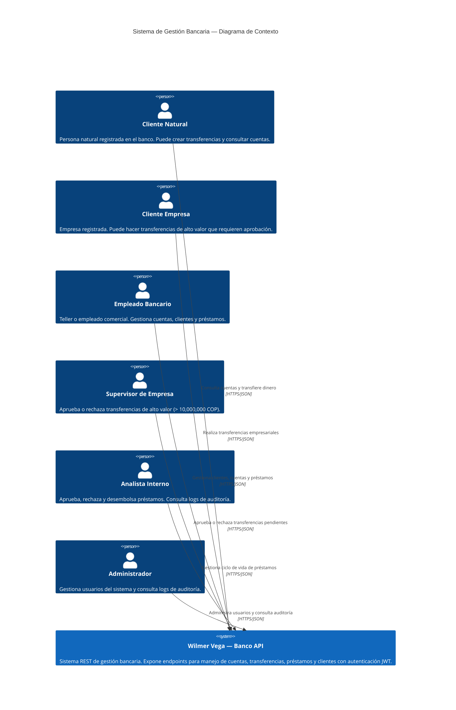

---

## Nivel 2 — Diagrama de Contenedores

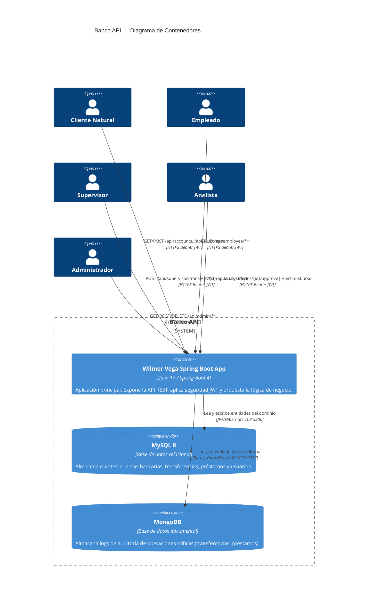

---

## Nivel 3 — Diagrama de Componentes (API)

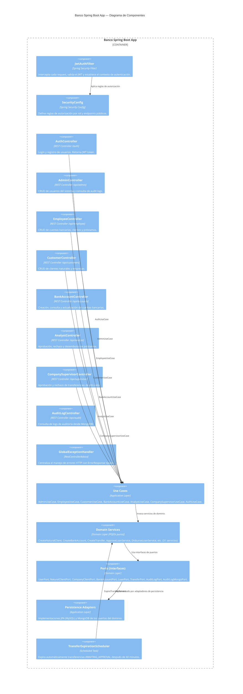

---

## Nivel 3 — Diagrama de Componentes (Dominio)

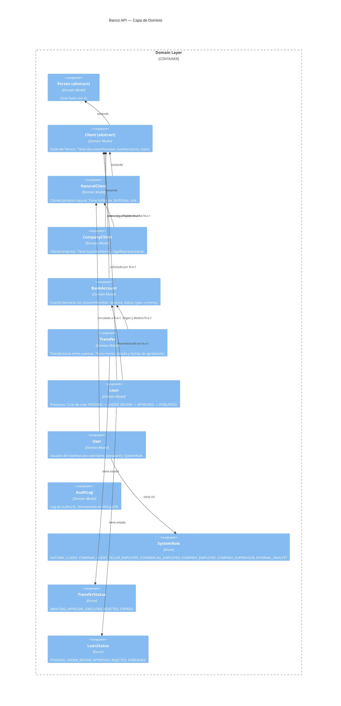

---

## Flujos de Secuencia

### Flujo 1: Autenticación JWT

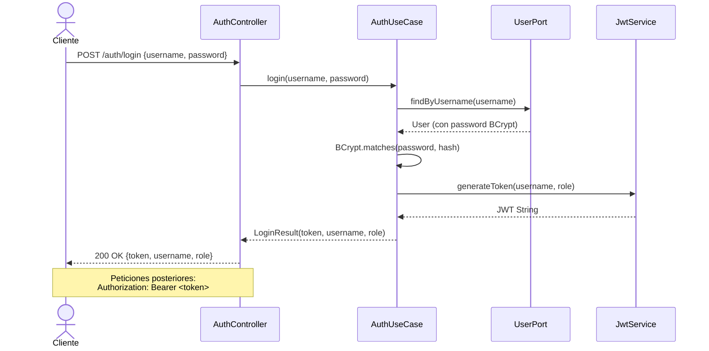

### Flujo 2: Creación de Transferencia

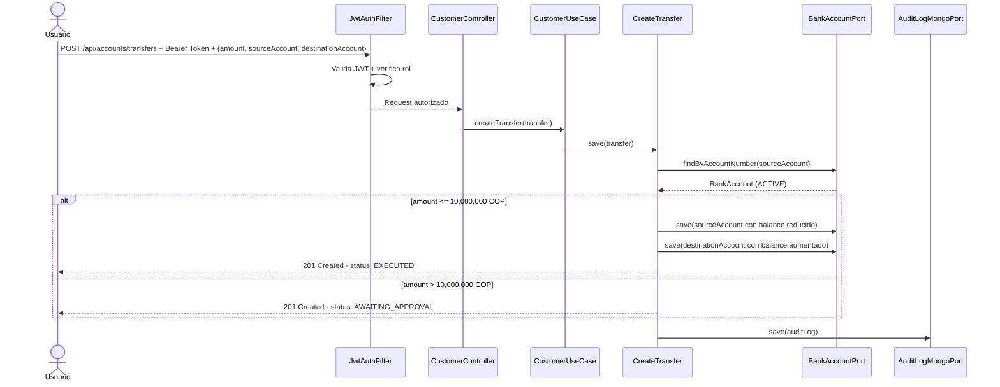

### Flujo 3: Aprobación de Transferencia

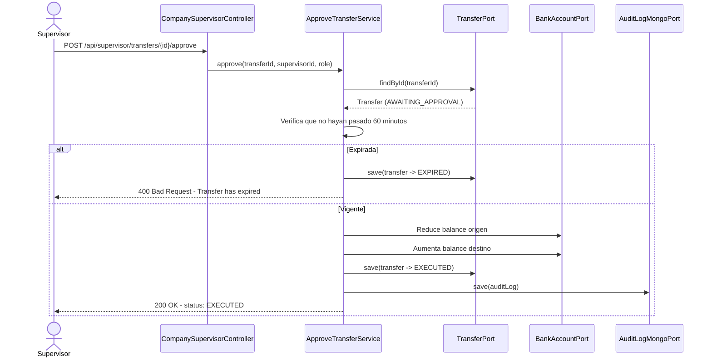

### Flujo 4: Aprobación de Préstamo

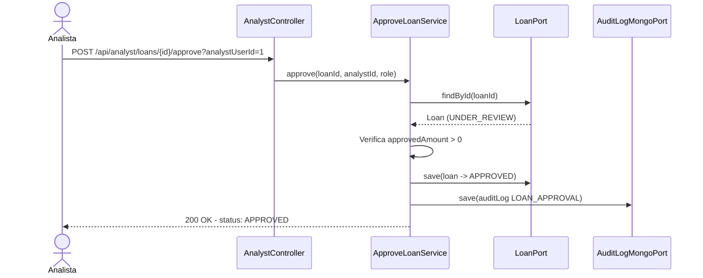

### Flujo 5: Desembolso de Préstamo

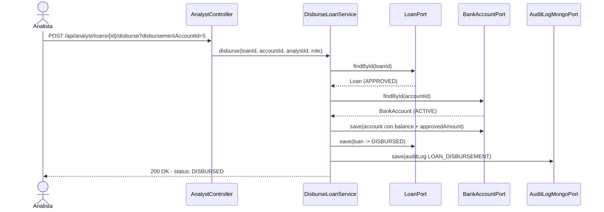

---

## Diagrama de Clases del Dominio

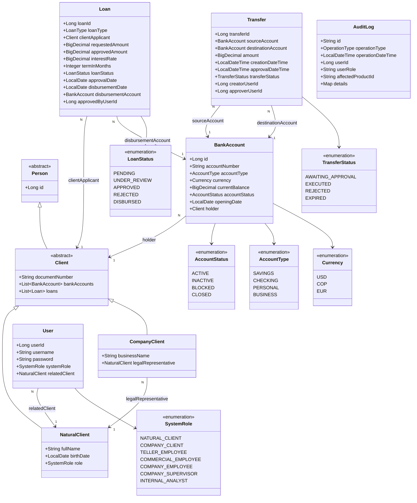

---

## Flujo de Seguridad JWT

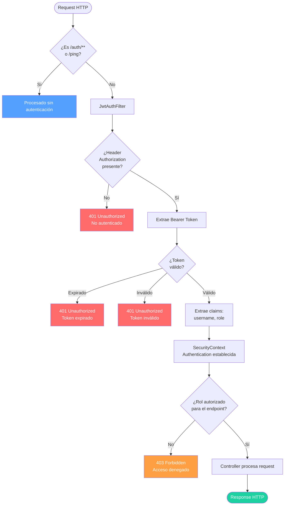

---

## Diagrama Entidad-Relación

```mermaid
erDiagram
    CLIENTS {
        bigint id PK
        varchar document_number UK
        varchar email
        varchar phone
        varchar address
    }

    NATURAL_CLIENTS {
        bigint id PK FK
        varchar full_name
        date birth_date
        varchar role
    }

    COMPANY_CLIENTS {
        bigint id PK FK
        varchar business_name
        bigint legal_rep_id FK
    }

    USERS {
        bigint id PK
        varchar username UK
        varchar password
        varchar role
        bigint client_id FK
    }

    BANK_ACCOUNTS {
        bigint id PK
        varchar account_number UK
        varchar account_type
        decimal current_balance
        varchar currency
        varchar account_status
        date opening_date
        bigint client_id FK
    }

    TRANSFERS {
        bigint transfer_id PK
        bigint source_account_id FK
        bigint destination_account_id FK
        decimal amount
        datetime creation_date_time
        datetime approval_date_time
        varchar transfer_status
        bigint creator_user_id
        bigint approver_user_id
    }

    LOANS {
        bigint loan_id PK
        varchar loan_type
        decimal requested_amount
        decimal approved_amount
        decimal interest_rate
        int term_in_months
        varchar loan_status
        date approval_date
        date disbursement_date
        bigint approved_by_user_id
        bigint client_id FK
        bigint disbursement_account_id FK
    }

    CLIENTS ||--o{ BANK_ACCOUNTS : "titular de"
    CLIENTS ||--o{ LOANS : "solicita"
    NATURAL_CLIENTS ||--|| CLIENTS : "extiende"
    COMPANY_CLIENTS ||--|| CLIENTS : "extiende"
    COMPANY_CLIENTS }o--|| NATURAL_CLIENTS : "representada por"
    USERS }o--|| CLIENTS : "vinculado a"
    TRANSFERS }o--|| BANK_ACCOUNTS : "cuenta origen"
    TRANSFERS }o--o| BANK_ACCOUNTS : "cuenta destino"
    LOANS }o--o| BANK_ACCOUNTS : "cuenta desembolso"
```
