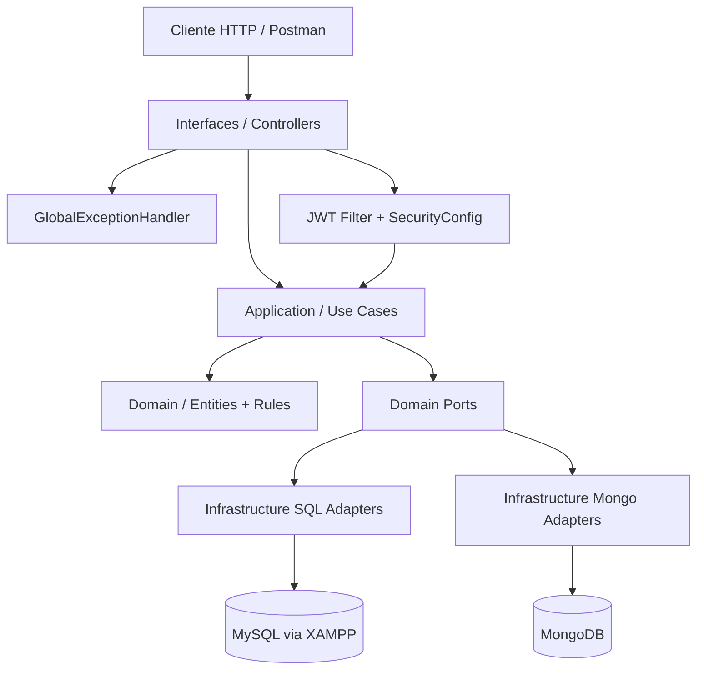
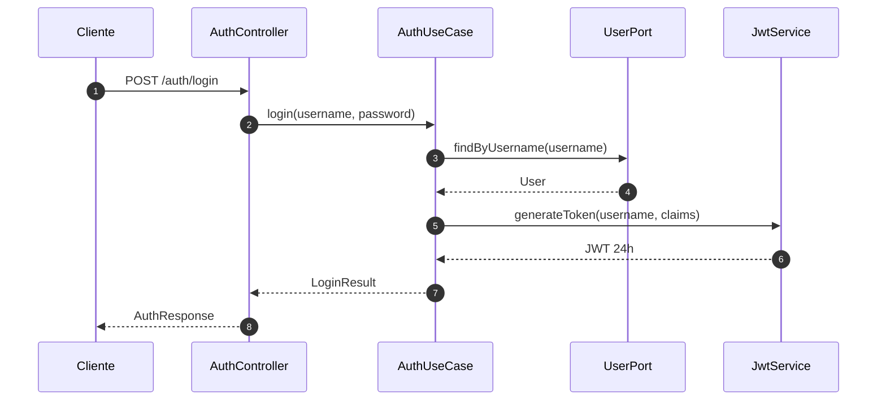

# Guía de arquitectura DDD y Clean Architecture

## 1. Diagnóstico inicial

La aplicación ya tiene una separación parcial entre controladores, casos de uso, dominio y persistencia, pero todavía mezcla responsabilidades en varios puntos:

- Hay lógica de negocio embebida en controladores HTTP.
- Existen servicios de dominio que hoy actúan más como casos de uso que como reglas de dominio puras.
- La capa de persistencia contiene mapeos manuales repetidos entre entidades y modelos de dominio.
- Había dos `@RestControllerAdvice` con políticas de error parecidas, lo que podía producir respuestas inconsistentes.
- La configuración JWT tenía la duración correcta de 24 horas, pero la secret seguía expuesta como valor local en el archivo de configuración.
- La autenticación todavía devolvía respuestas armadas manualmente con `Map` en lugar de contratos tipados.

## 2. Estructura objetivo

La organización recomendada para este proyecto es:

```text
src/main/java/gestiondeunbanco/wilmervega/
  domain/
    model/
    valueobjects/
    services/
    ports/
    exceptions/
  application/
    usecases/
    dto/
    mappers/
  infrastructure/
    persistence/
      sql/
      mongo/
    security/
    config/
  interfaces/
    rest/
      controllers/
      dto/
      advice/
  shared/
    constants/
    utils/
```

### Qué va en cada capa

- `domain`: reglas de negocio puras, entidades, value objects, excepciones de negocio y puertos.
- `application`: casos de uso, orquestación, DTOs de entrada/salida y mappers de aplicación.
- `infrastructure`: adaptadores técnicos, seguridad, configuración, SQL, MongoDB y clientes externos.
- `interfaces`: controladores REST, request/response DTOs y manejo HTTP.
- `shared`: utilidades transversales, constantes y componentes reutilizables sin dependencia de dominio.

## 3. Qué movería y por qué

### Dominio

- Entidades como `User`, `NaturalClient`, `CompanyClient`, `BankAccount`, `Loan`, `Transfer` y `AuditLog` deben quedarse en dominio, pero idealmente sin depender de detalles de persistencia.
- Las validaciones de negocio como edad mínima, reglas de roles y consistencia entre tipos de cliente deben vivir aquí o en servicios de dominio específicos.
- Las excepciones `BusinessException`, `NotFoundException` e `InvalidCredentialsException` deben mantenerse en el dominio para que no dependan de HTTP.

### Aplicación

- `AuthUseCase`, `AdminUseCase`, `EmployeeUseCase`, `CustomerUseCase`, `ClientUseCase`, `BankAccountUseCase`, `AnalystUseCase` y `CompanySupervisorUseCase` son coordinadores de casos de uso.
- Los DTOs de salida como `LoginResult` y `AuthResponse` deberían vivir en aplicación o en interfaces, según el nivel de acoplamiento deseado.
- Los mappers entre dominio y DTO deben sacarse del controlador y centralizarse aquí.

### Infraestructura

- `JwtService`, `JwtAuthenticationFilter`, `UserDetailsServiceImpl`, `BeanConfig`, `SecurityConfig`, `DataInitializer` y la integración con Mongo/MySQL son infraestructura.
- Los repositorios Spring Data y los adapters SQL/Mongo también pertenecen aquí.
- Las clases `*PersistenceAdapter` son adaptadores de infraestructura, no dominio.

### Interfaces / Controllers

- Los controladores REST deben limitarse a:
  - recibir requests
  - validar entrada
  - invocar casos de uso
  - devolver responses
- No deben construir reglas de negocio ni hablar directamente con repositorios.

### Shared / Common

- Utilidades comunes, constantes de errores, formatos de respuesta y helpers reutilizables.
- No debe convertirse en un cajón de sastre.

## 4. Estado del refactor ya aplicado

Ya se aplicaron dos mejoras iniciales:

- `JWT_SECRET` ahora se lee desde configuración externa y la duración se expresa como `24h`.
- Se eliminó un handler global duplicado para dejar una sola política HTTP de errores.
- La autenticación ya usa una respuesta tipada (`AuthResponse`) y la semántica de credenciales inválidas está centralizada en una excepción de dominio.

## 4.1 Diagrama general



## 4.2 Flujo paso a paso de una petición

1. El cliente llama un endpoint REST.
2. El controlador valida la entrada y transforma el request a un formato de aplicación.
3. El caso de uso ejecuta la regla de negocio.
4. El caso de uso consulta puertos del dominio.
5. El adaptador de infraestructura persiste o lee en MySQL o MongoDB.
6. El controlador convierte la salida a un DTO HTTP y responde.

## 4.3 Diagrama del login JWT



## 5. Configuración recomendada de JWT

Variables sugeridas:

- `JWT_SECRET`
- `JWT_EXPIRATION=24h` si se quiere parametrizar en despliegue

Ejemplo de configuración esperada:

```properties
jwt.secret=${JWT_SECRET}
jwt.expiration=24h
```

## 6. SQL y MongoDB

### SQL

- Mantener compatibilidad con XAMPP y MySQL local.
- Centralizar la URL y credenciales en variables de entorno.
- No acoplar el código de negocio a JPA.

### MongoDB

- Usar Mongo para auditoría y bitácora.
- Tratarlo como almacén técnico, no como fuente de verdad del dominio transaccional.

## 7. Plan de migración por módulos

### Fase 1: Seguridad y autenticación

- Consolidar JWT, errores de login y contrato de respuesta.
- Extraer configuración sensible a variables de entorno.
- Mantener endpoints actuales sin renombrarlos.

### Fase 1.1 Qué cambió ya en el código

- `jwt.expiration=24h` ya está configurado en propiedades.
- `JWT_SECRET` ya puede venir desde el entorno.
- `AuthController` devuelve `AuthResponse` en lugar de construir `Map` manualmente.
- `InvalidCredentialsException` se mapea a 401 en un único `GlobalExceptionHandler`.

### Fase 2: Controladores

- Reemplazar `Map` por DTOs tipados donde todavía se usan respuestas ad hoc.
- Eliminar conversiones repetidas en los controladores.

### Fase 3: Persistencia

- Extraer mappers SQL/Mongo a clases dedicadas.
- Reducir lógica de conversión dentro de los adapters.
- Separar repositorios por fuente de datos y por agregado.

### Fase 3.1 Qué se refactorizó ya

- `NaturalClient`, `CompanyClient` y `User` ahora usan mappers dedicados.
- `BankAccountRepository` expone la búsqueda por estado con el tipo correcto de entidad.
- `NaturalClientPersistenceAdapter` dejó de filtrar en memoria para usar el repositorio directo.
- `AuditLogMongoAdapter` ahora devuelve colecciones con `toList()` y mantiene solo la traducción técnica.

### Fase 4: Dominio y aplicación

- Revisar los servicios que hoy viven en `domain/services` y decidir cuáles son reglas puras y cuáles son casos de uso.
- Consolidar validaciones repetidas.
- Normalizar nombres: entidad, aggregate, use case, service, mapper.

### Fase 5: Seguridad y consistencia

- Revisar roles y permisos.
- Evitar mensajes internos innecesarios en respuestas de error.
- Añadir pruebas de integración para auth y rutas críticas.

## 8. Cómo ejecutar el proyecto

- Backend: `./mvnw.cmd spring-boot:run`
- Compilación: `./mvnw.cmd -q -DskipTests compile`
- Variables mínimas:
  - `MYSQL_URL`
  - `MYSQL_USER`
  - `MYSQL_PASSWORD`
  - `MONGODB_URI`
  - `MONGODB_DATABASE`
  - `JWT_SECRET`

  ## 9. Mapa rápido de archivos

  - [README principal](../README.md)
  - [Guía de dominio](../src/main/java/gestiondeunbanco/wilmervega/domain/models/README.md)
  - [Arquitectura DDD](arquitectura-ddd.md)

  ## 10. Si no ves la documentación

  Si esta guía no te aparece en el explorador de VS Code, abre directamente [docs/arquitectura-ddd.md](arquitectura-ddd.md) desde el README principal. La documentación ahora está enlazada desde la portada del proyecto para que no quede aislada.

  ## 11. Recomendación práctica

La siguiente pieza que conviene refactorizar es la persistencia SQL, empezando por los adapters y mappers repetidos, porque ahí es donde hoy se concentra la mayor parte de la duplicación estructural del proyecto.
